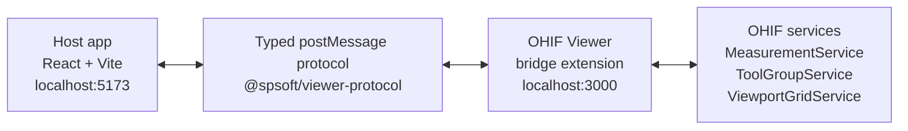
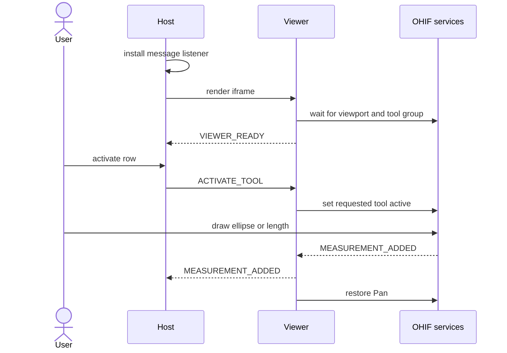

# Architecture

## System boundary

The solution has two independently served frontend applications:



The host owns the scoring form and embeds OHIF in an iframe. The Viewer bridge is an OHIF
extension. It converts typed host commands into OHIF service calls and converts OHIF measurement
events into protocol messages. Neither application imports runtime state from the other.

The shared package at `packages/spsoft-protocol` contains the TypeScript types, message factory,
runtime parser, and unit normalization. Both applications depend on this package.

## Message envelope

Every message has the same outer shape:

```ts
interface BridgeMessage {
  channel: 'spsoft.viewer-bridge';
  version: 1;
  type: BridgeMessageType;
  messageId: string;
  payload: BridgePayloadByType[BridgeMessageType];
}
```

`channel` prevents unrelated `message` traffic from reaching bridge logic. `version` gives the
parser an explicit compatibility boundary. Version 1 includes the core flow and the additive focus,
live update, deletion, and persistence messages. An older Viewer may omit
`capabilities.measurementFocus` or `capabilities.statePersistence`; the parser normalizes either
omission to `false`, while still rejecting a non-boolean value. A future incompatible payload
change would require a new version.

Each sender creates a fresh `messageId` with `crypto.randomUUID()`. The host remembers accepted
Viewer message IDs for the current session and ignores duplicates.

## Message contract

| Direction | Type | Payload | Purpose |
| --- | --- | --- | --- |
| Viewer to host | `VIEWER_READY` | `viewerInstanceId`, `supportedTools`, capability flags | Announces a ready Viewer session and its supported behavior. |
| Host to Viewer | `ACTIVATE_TOOL` | `targetViewerInstanceId`, `rowId`, `activationId`, `toolName` | Arms `EllipticalROI` or `Length` for one typed form row. |
| Host to Viewer | `DEACTIVATE_TOOL` | `targetViewerInstanceId`, `rowId`, `activationId`, `reason` | Cancels the matching activation and restores Pan. |
| Host to Viewer | `FOCUS_MEASUREMENT` | `targetViewerInstanceId`, `rowId`, `annotationId` | Selects a correlated annotation and navigates the Viewer to it. |
| Host to Viewer | `REMOVE_MEASUREMENT` | `targetViewerInstanceId`, `rowId`, `annotationId` | Removes one correlated OHIF measurement. |
| Host to Viewer | `RESTORE_MEASUREMENTS` | `targetViewerInstanceId`, expected `rowId`/`annotationId`/`toolName` bindings | Requests restoration of only the records still owned by the form. |
| Viewer to host | `MEASUREMENT_ADDED` | `viewerInstanceId`, `rowId`, `activationId`, `annotationId`, `measurement` | Completes the active row with a newly created annotation. |
| Viewer to host | `MEASUREMENT_UPDATED` | `viewerInstanceId`, `rowId`, `annotationId`, `measurement` | Updates the value after a correlated annotation changes. |
| Viewer to host | `MEASUREMENT_REMOVED` | `viewerInstanceId`, `rowId`, `annotationId` | Confirms removal or reports deletion initiated in OHIF. |
| Viewer to host | `MEASUREMENTS_RESTORED` | `viewerInstanceId`, restored bindings and measurements | Confirms which persisted annotations were recreated in OHIF. |

`toolName` allows `EllipticalROI` and `Length`. `reason` is `user-cancelled`, `superseded`, or
`host-unmounted`. `supportedTools` contains only the tools present in the active OHIF tool group
and may be empty.

`measurement` has this shape:

```ts
interface AreaMeasurement {
  kind: 'area';
  value: number;
  unit: 'mm2' | 'cm2' | 'px2' | 'unknown';
  rawUnit: string;
  calibrationType?: string;
}

interface LengthMeasurement {
  kind: 'length';
  value: number;
  unit: 'mm' | 'cm' | 'px' | 'unknown';
  rawUnit: string;
  calibrationType?: string;
}

type Measurement = AreaMeasurement | LengthMeasurement;
```

The runtime parser rejects unknown message types, invalid enum values, empty IDs, negative or
non-finite values, and inconsistent normalized units. TypeScript types alone are not used as input
validation because `MessageEvent.data` is untrusted at runtime. The host and Viewer also verify
that `area` belongs to an `EllipticalROI` activation and `length` belongs to a `Length` activation.

## Identifier ownership and correlation

| Identifier | Issuer | Lifetime | Use |
| --- | --- | --- | --- |
| `viewerInstanceId` | Viewer bridge | One OHIF mode session | Invalidates commands and events from an older iframe or mode session. |
| `rowId` | Host app | One form row | Identifies the form destination for a measurement. |
| `activationId` | Host app | One activation attempt | Prevents a late result from completing a newer attempt for the same row. |
| `annotationId` | OHIF MeasurementService | One annotation | Identifies later updates and deletion of the Viewer measurement. |
| `messageId` | Message sender | One message | Deduplicates Viewer messages accepted by the host. |

The host creates `rowId` when a row is added and creates `activationId` for every activation. The
Viewer returns both values with `MEASUREMENT_ADDED`, together with the OHIF `annotationId`. After
acceptance, both sides keep in-memory `annotationId -> rowId` and `annotationId -> toolName` maps
for the current Viewer session.

The host accepts a creation only when all of these values match the active request. Updates and
removals must match the current `viewerInstanceId` and the stored annotation-to-row binding.
Unarmed and unrelated OHIF annotations never enter the form.

## Handshake and early commands

The host installs its `message` listener before rendering the iframe. The Viewer bridge installs
its listener during extension `preRegistration`, then creates a new `viewerInstanceId` on mode
entry. It sends `VIEWER_READY` only after an active viewport and a tool group exist. OHIF readiness
events trigger new checks, with bounded retries covering service initialization races.



If the user activates a row before `VIEWER_READY`, the host stores one pending request. It flushes
that request after the handshake. A second activation is rejected as busy while one request is
queued or drawing. The request therefore cannot disappear during a slow iframe startup, and two
rows cannot claim the same annotation.

Every host command includes `targetViewerInstanceId`. The Viewer ignores a command addressed to a
previous session.

## Measurement lifecycle

1. The host moves a row from `waiting` to `queued` or `drawing`.
2. The Viewer activates the row's `EllipticalROI` or `Length` tool through `commandsManager` and
   records the row, activation ID, and expected tool as the armed request.
3. `MeasurementService` emits an add or update event. The bridge reads either `area`/`areaUnit` or
   `length`/`unit` from OHIF measurement data. If cached statistics are not ready on the first add
   event, it waits for the matching update.
4. The Viewer stores the annotation-to-row binding, sends `MEASUREMENT_ADDED`, and restores Pan.
5. The host checks the active request, session, IDs, and duplicate set before moving the row to
   `ready`.

Later OHIF updates produce `MEASUREMENT_UPDATED`. The Viewer compares each normalized measurement
with the last published value for that annotation and drops unchanged events. The host changes only
the bound row and derives new totals from reducer state. Its duplicate-message cache retains only a
bounded window of recent identifiers, so a long editing session does not grow the set indefinitely.

Clicking a completed form row sends `FOCUS_MEASUREMENT` only when the current Viewer advertised
that capability and no drawing operation is armed. This guard prevents focus navigation from
redirecting the active drawing tool to another image or slice before its annotation is completed.
Both sides verify the stored annotation-to-row binding. The Viewer then runs OHIF's
`jumpToMeasurementViewport` command with the corresponding MeasurementService entry. The command
selects the annotation and navigates a compatible viewport to its image or slice.

For form-initiated deletion, the host sends `REMOVE_MEASUREMENT` and marks the annotation as
pending. It removes the form row only after OHIF emits removal and the Viewer returns
`MEASUREMENT_REMOVED`. If deletion starts in OHIF, the same event clears the linked row and returns
it to `waiting`. Uncorrelated removal events are ignored.

## Preventing echo loops

Live values have one event direction: OHIF emits an update, the Viewer posts it, and the host
updates local reducer state. The host does not send measurement values back to OHIF, so an update
cannot bounce between applications.

Deletion uses a command and confirmation pair. `REMOVE_MEASUREMENT` asks OHIF to remove an
annotation. `MEASUREMENT_REMOVED` confirms the resulting service event. The host consumes the
confirmation without sending another removal command. Correlation maps and pending deletion state
also make repeated or unrelated events no-ops.

## Origin and source checks

The two origins are explicit configuration, not wildcards:

- host accepts events only from the configured Viewer origin and its iframe `contentWindow`
- Viewer accepts events only from the configured host origin and `window.parent`
- every `postMessage` call uses the exact target origin
- both sides parse the shared channel, version, type, and payload before handling a message
- Viewer commands must target the current `viewerInstanceId`

Checking `event.origin` blocks another origin. Checking `event.source` also blocks a different
window served from an otherwise allowed origin. If two host tabs are open, each tab accepts events
only from its own iframe.

## Reload, persistence, and cleanup

The two applications have different origins, so each owns a versioned, study-scoped local storage
record. The host stores row order, row type, normalized measurement, and correlation IDs. The
Viewer stores only annotations created through the bridge, including their Cornerstone geometry.
Transient `queued`/`drawing` states are never persisted as completed measurements.

Iframe load starts a new handshake. The host clears the old in-memory session and moves completed
rows to `restoring`. After a persistent Viewer announces readiness, the host sends
`RESTORE_MEASUREMENTS` with the bindings it still owns. The Viewer intersects that request with its
validated storage, re-adds matching annotations through Cornerstone annotation state, confirms the
measurements through OHIF `MeasurementService`, and replies with `MEASUREMENTS_RESTORED`. Only then
does the host return matching rows to `ready` and rebuild both sides' correlation maps. Missing
records become waiting rows; Viewer records not requested by the host are removed. This
host-authoritative intersection prevents stale or unrelated annotations from reappearing.
If the Viewer advertises persistence but does not confirm restoration within five seconds, the host
also returns affected rows to `waiting` instead of leaving the form blocked in `restoring`.

Storage parsing is defensive: the version, study UID, bounded record count, unique IDs, supported
tool, normalized measurement, referenced image, frame of reference, and finite handle coordinates
must all be valid. Storage failures leave the in-memory workflow usable. A Viewer without the
additive persistence capability falls back to waiting rows.

On React unmount, the host removes its listener and deactivates an armed tool when possible. On
OHIF mode exit, the bridge restores Pan, removes the window listener, unsubscribes from OHIF
services, cancels readiness timers, and clears its in-memory maps.

Both iframe reload and full page reload restore completed form rows and their correlated
annotations for the current study. Waiting rows are also retained in the form.

These browser records have no application-defined expiry and are not uploaded to a backend. They
remain on each origin until the user deletes the corresponding rows, clears site data, or the
browser evicts local storage. A production clinical deployment would need an explicit retention
policy and server-side controls for authentication, authorization, encryption, and auditability;
this browser-only persistence is limited to the test task.

## Units and totals

The bridge preserves the exact OHIF unit as `rawUnit` and also derives a canonical unit. Area totals
(`mm²`, `cm²`, `px²`) and length totals (`mm`, `cm`, `px`) are derived independently and never
combined with each other. Physical and pixel units also remain separate. Measurements with an
unknown unit are grouped only when their normalized raw labels match. The form stores the numeric
value unchanged and applies Ukrainian number formatting only while rendering.

The footer derives totals from rows in `ready` or confirmation-pending `deleting` state. A
form-initiated deletion stays in the total until Viewer confirmation, which keeps the form
consistent with the annotation still visible in OHIF.

## Accepted decisions

- A monorepo keeps the shared protocol as one source of truth and allows one command to start both
  applications. The Viewer and host still run as separate builds on separate origins.
- `postMessage` matches the iframe boundary without adding a backend, socket connection, or shared
  global state.
- The host owns workflow IDs because it owns rows and activation attempts. OHIF owns annotation
  IDs because it creates the measurements.
- `useReducer` is enough for the local form state. There is no server state that would justify
  TanStack Query, and the workflow does not require Redux or sagas.
- Active correlation maps remain session-scoped in memory and are rebuilt only from the validated
  host/Viewer persistence handshake. Stale stored data cannot directly become an active binding.

## Test scope

The focused Jest projects cover protocol parsing and units, both tool types, bridge behavior,
reducer transitions, and separate totals. Playwright exercises the two-origin flow with a real OHIF
runtime, including Ellipse and Length creation, early activation, focus navigation, live updates,
deletion in both directions, malformed messages, iframe reload, and full-page state restoration.

The assignment does not require tests for the full OHIF monorepo, so `yarn test:spsoft` runs only
the added SPSoft packages and integration scenarios.
